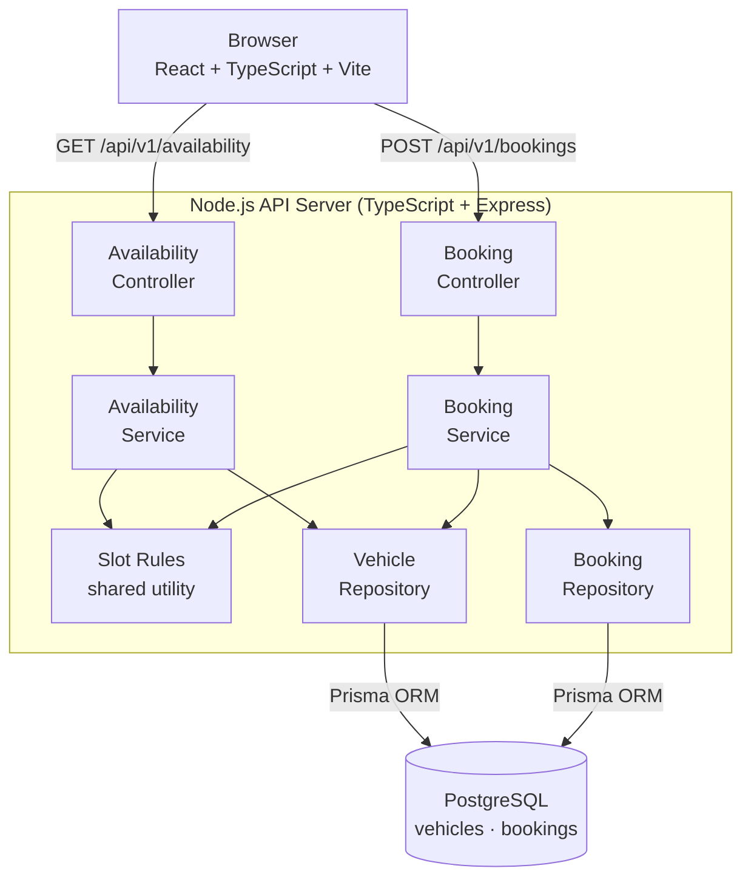

# High-Level Design - Nevo Test Drive Service

## Overview

The Nevo Test Drive Service provides on-demand scheduling of EV test drives. Customers can check vehicle availability and book a slot in a single flow. The system enforces business rules around vehicle availability, prevents double-bookings under concurrent load, and distributes bookings evenly across vehicles of the same type at a location.

---

## Architecture



The application is a **modular monolith**: a single deployable unit with clear internal separation of concerns across controllers, services, and repositories. This avoids microservice operational overhead while keeping the domain boundaries explicit and easy to evolve.

See [Low-Level Design](./lld.md) for detailed request flow diagrams.

---

## Data Model

### vehicles

| Column                          | Type       | Notes                              |
|---------------------------------|------------|------------------------------------|
| `id`                            | `varchar`  | Primary key (e.g. `tesla_1001`)    |
| `type`                          | `varchar`  | e.g. `tesla_model3`                |
| `location`                      | `varchar`  | e.g. `dublin`                      |
| `available_from_time`           | `time`     | e.g. `08:00:00`                    |
| `available_to_time`             | `time`     | e.g. `18:00:00`                    |
| `available_days`                | `varchar[]`| e.g. `["mon","tue","wed","thur","fri"]` |
| `minimum_minutes_between_bookings` | `int`   | Buffer enforced between bookings   |

### bookings

| Column           | Type        | Notes                          |
|-----------------|-------------|--------------------------------|
| `id`             | `uuid`      | Primary key                    |
| `vehicle_id`     | `varchar`   | FK → vehicles.id               |
| `start_datetime` | `timestamptz` | UTC                          |
| `end_datetime`   | `timestamptz` | Computed: start + duration   |
| `customer_name`  | `varchar`   |                                |
| `customer_email` | `varchar`   |                                |
| `customer_phone` | `varchar`   |                                |

---

## Core Design Decisions

### PostgreSQL over NoSQL

The booking domain is inherently transactional - a slot either belongs to one customer or none. PostgreSQL provides:

- **ACID transactions** - atomicity across the availability check and booking insert
- **Row-level locking** (`SELECT ... FOR UPDATE`) - prevents concurrent requests from booking the same slot
- **Relational modeling** - clean FK between bookings and vehicles, enabling reliable constraint enforcement

A document store (MongoDB, DynamoDB) would require application-level locking to achieve the same correctness guarantees, which is more error-prone.

### Backend owns all availability and assignment logic

The frontend never sees a vehicle ID. The availability endpoint returns only `{ available: boolean }`. When the customer confirms, the booking endpoint accepts `vehicleType`, `location`, and slot details — the backend selects the vehicle internally using the distribution algorithm inside the same transaction that creates the booking. This means:

- Business rules live in one place
- Vehicle inventory is never exposed to the client
- Distribution cannot be bypassed by sending an arbitrary vehicle ID
- Vehicle assignment and booking creation are atomic

### Modular monolith over microservices

Given the scope (two endpoints, one domain), splitting into services would add infrastructure overhead with no architectural benefit. The layered structure (controller → service → repository) keeps concerns separated and makes the code straightforward to reason about, test, and extend.

---

## Availability Rules

A vehicle is considered available for a requested slot only when **all** of the following are true:

| Rule                    | Description                                                                 |
|------------------------|-----------------------------------------------------------------------------|
| **Type match**          | Vehicle's `type` equals the requested `vehicleType`                         |
| **Location match**      | Vehicle's `location` equals the requested `location`                        |
| **Day match**           | Day of `startDateTime` is in the vehicle's `availableDays`                  |
| **Hours window**        | Full booking window fits within `availableFromTime` → `availableToTime`     |
| **No overlap**          | Booking window does not overlap any existing reservation                    |
| **Buffer respected**    | Gap between this booking and any adjacent booking ≥ `minimumMinutesBetweenBookings` |

Overlap check uses half-open intervals: `[start, end)`. The buffer check extends the window on both sides when querying for conflicts.

---

## Even Distribution Algorithm

When multiple vehicles satisfy the availability rules, the system picks the one with the **fewest bookings today**. Ties are broken by `vehicle.id` ascending, making the selection deterministic.

```
Eligible vehicles (type + location + slot available):
  tesla_1001 → 12 bookings
  tesla_1002 → 5 bookings
  tesla_1003 → 7 bookings

Selected: tesla_1002
```

This approach is:

- **Deterministic** - same input always produces the same output
- **Correct** - load spreads over time as bookings accumulate
- **Simple** - no global state, no in-memory counters, derived from the database

A random assignment would fail to converge on even distribution. A round-robin would require persisting state and be more brittle under concurrent requests.

---

## Concurrency Handling

The availability response is **advisory only**. A slot that appears available at check time may be taken before the booking request arrives. To prevent double-booking under concurrent load:

```
Thread A: GET /availability  →  available: true
Thread B: GET /availability  →  available: true
Thread A: POST /bookings       ┐
Thread B: POST /bookings       ┘ (concurrent)
```

The booking endpoint handles this as follows:

1. Read eligible vehicles for the requested type, location, and slot
2. Select the least-booked vehicle (e.g. tesla_1001)
3. Open a database transaction
4. Call `pg_try_advisory_xact_lock(hashtext(vehicleId), hashtext(startDateTime))` - acquires a non-blocking PostgreSQL advisory lock scoped to vehicle + exact start time. Two requests for the same vehicle at different non-conflicting slots are not serialised; two requests for the exact same slot are.
5. If the lock is already held by another transaction: immediately return `409 SLOT_UNAVAILABLE` (no waiting)
6. Re-run all availability checks inside the transaction with fresh data
7. If still available: insert the booking and commit - lock releases automatically
8. If no longer available: roll back and return `409 SLOT_UNAVAILABLE`

**Why advisory lock over `SELECT FOR UPDATE`:**

`SELECT FOR UPDATE` (row-level lock) blocks waiting transactions - each holds a database connection while queuing. Under high concurrency this exhausts the connection pool, causing all requests (including unrelated ones) to time out. The advisory lock approach is non-blocking: the first transaction wins the lock, all others fail immediately without holding a connection. This keeps throughput predictable and avoids connection starvation.

---

## Consistency Model

This system prioritises **consistency over availability** (CP in CAP theorem terms). Under a partition or DB outage, the API returns errors rather than serving potentially stale or incorrect data. A double-booking is worse than a temporary 503.

Every layer of the stack is designed to enforce this:

| Mechanism | What it guarantees |
|---|---|
| **ACID transactions** | Every booking either fully commits or fully rolls back - no partial state |
| **Advisory lock** | Concurrent booking attempts for the same vehicle are serialised - first caller wins, all others immediately get 409 |
| **Business rules re-checked inside the transaction** | Operating hours, day availability, and conflict checks run against fresh DB data inside the lock - availability check result is never trusted blindly |
| **No read cache** | Availability queries always hit the primary DB - a slot booked 1ms ago is immediately invisible to the next check |
| **Synchronous confirmation** | The API only returns 201 after the DB has committed - the HTTP response IS the ground truth |
| **FK constraint** | `bookings.vehicleId` references `vehicles.id` with `ON DELETE RESTRICT` - a booking for a non-existent vehicle cannot be inserted |
| **Single primary DB** | No read replicas that could serve stale data - all reads and writes go to the same PostgreSQL instance |

**What this means in practice:**

- If the DB is unreachable, the API returns 500 - it never serves a cached or guessed response
- If the advisory lock is already held, concurrent requests get 409 immediately - they are never queued or retried silently
- There is no eventual consistency path - no async workers, no event queues that could silently fail and leave the DB in an inconsistent state

**What availability is sacrificed:**

Availability caching (Redis) is listed as a future improvement but deliberately excluded from the current design. Adding a cache would improve throughput under read load but would introduce a window where a booked slot still appears available. For a booking system, that trade-off is unacceptable without explicit cache invalidation on every booking commit.

---

## Testing Strategy

Tests focus on correctness of the critical path, not coverage breadth.

### Backend - Jest (integration tests against real PostgreSQL)

| Area                        | What is tested                                                              |
|----------------------------|-----------------------------------------------------------------------------|
| **Availability - type**     | Requests for a non-matching vehicle type return `available: false`          |
| **Availability - location** | Requests for the wrong location return `available: false`                   |
| **Availability - hours**    | Requests outside operating hours return `available: false`                  |
| **Booking - success**       | A valid booking is created and persisted                                    |
| **Booking - overlap**       | A booking that overlaps an existing reservation is rejected                 |
| **Booking - buffer**        | A booking within the minimum buffer window is rejected                      |
| **Booking - boundary**      | A booking starting exactly at buffer expiry is accepted                     |
| **Distribution**            | The least-booked eligible vehicle is selected                               |
| **Distribution - tie**      | Ties are broken by vehicle ID ascending                                     |
| **Distribution - spread**   | Sequential requests each land on a different vehicle                        |
| **Concurrency - 2**         | Two simultaneous booking requests for the same slot: exactly one succeeds   |
| **Concurrency - 5**         | Five simultaneous booking requests for the same slot: exactly one succeeds  |

### Frontend - Vitest + React Testing Library

| Area                   | What is tested                                                          |
|-----------------------|-------------------------------------------------------------------------|
| **Form rendering**     | All fields render correctly; checking state disables the submit button  |
| **Validation**         | Errors shown on empty submit; errors clear on field change              |
| **Available flow**     | Available response → confirm step shows slot details                    |
| **Unavailable flow**   | Unavailable response → alert shown, form stays in place                 |
| **Alert dismiss**      | Clicking × removes the unavailable alert                                |
| **Booking success**    | Confirming → success state shows booking ID                             |
| **409 handling**       | 409 from booking endpoint → alert shown, back to form                   |
| **Reset flow**         | "Book another" returns to the empty form                                |

---

## Running Locally

See [Local Setup Guide](./local-setup.md) for full instructions.

**Reviewer (one-step):**
```bash
./dev.sh
```

**Local development:** spin up only PostgreSQL via Docker/Podman Compose, then run the backend and frontend directly with `npm run dev` for hot reload.

---

## Future Improvements

| Improvement                  | Rationale                                                                 |
|-----------------------------|---------------------------------------------------------------------------|
| **Notification service**     | Send booking confirmation and reminder emails via a queue (e.g. SQS → SES) |
| **Event-driven architecture** | Publish `BookingCreated` events for analytics, auditing, notifications   |
| **Availability caching**     | Cache availability responses in Redis with short TTL to reduce DB load    |
| **Distributed locking**      | Redis-based lock for multi-region deployments where DB locking is insufficient |
| **Distributed tracing**      | Correlate requests across services; add trace IDs to pino log lines       |
| **Pagination on bookings**   | As reservation history grows, list endpoints will need cursor pagination  |

---

## Trade-offs

| Decision                          | What was gained                      | What was accepted                                  |
|----------------------------------|--------------------------------------|----------------------------------------------------|
| CP over AP (no read cache)       | Slot state always accurate           | Higher DB read load; no availability response if DB is down |
| Modular monolith                 | Simple deployment, low overhead      | Single point of failure; harder to scale independently |
| Today's booking count for distribution | Reflects current day load; new vehicles not penalised by history | A vehicle with many morning bookings is deprioritised for afternoon slots even if it is idle |
| Advisory lock for concurrency    | Non-blocking, no connection starvation | Concurrent requests for different slots on the same vehicle are still serialised |
| UTC only, no timezone conversion | Simplicity, no DST ambiguity in storage | `availableFromTime`/`availableToTime` have no timezone attached - the system assumes they are UTC. A Dublin dealership setting `"08:00:00"` intends 8am IST (UTC+1 in summer), but the system interprets it as 8am UTC. A customer booking at 8am local time sends `07:00Z`, which falls outside the `08:00` window and gets rejected. Fix: store vehicle hours with an explicit IANA timezone (e.g. `Europe/Dublin`) and compare using that. |
