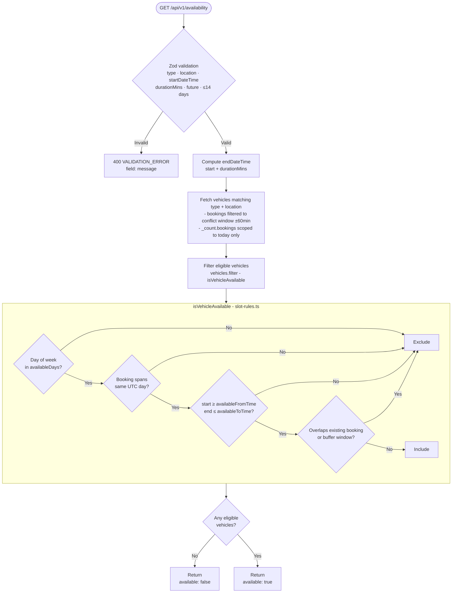
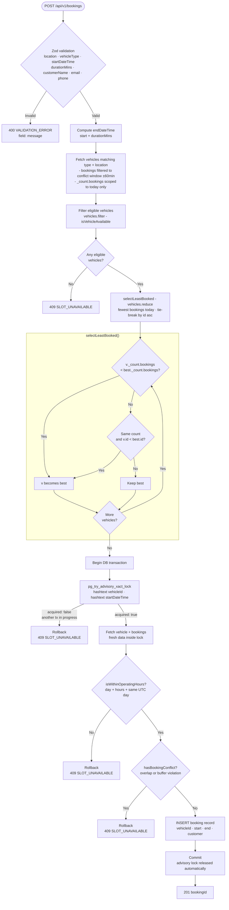
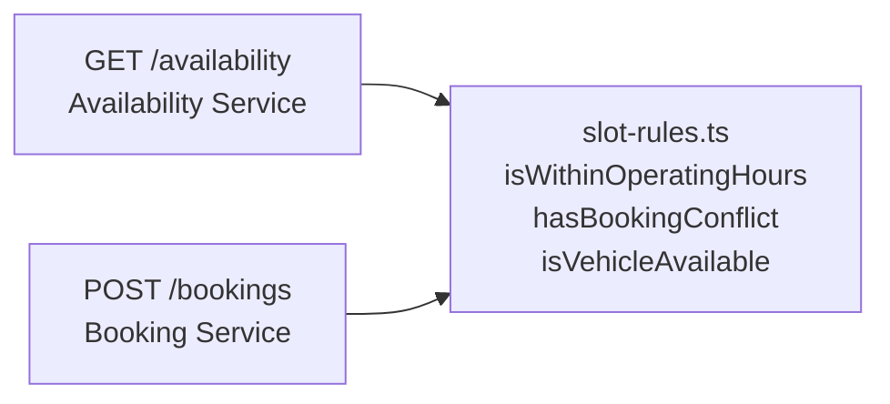

# Low-Level Design - Nevo Test Drive Service

Detailed request flow for each endpoint. See [High-Level Design](./hld.md) for architecture and data model.

---

## GET /api/v1/availability

---

## POST /api/v1/bookings

---

## Shared: Slot Rules

Both flows share `src/utils/slot-rules.ts`. The availability endpoint uses it to filter candidates; the booking endpoint re-runs the same checks inside the transaction as a safety net, regardless of whether the availability endpoint was called first.

